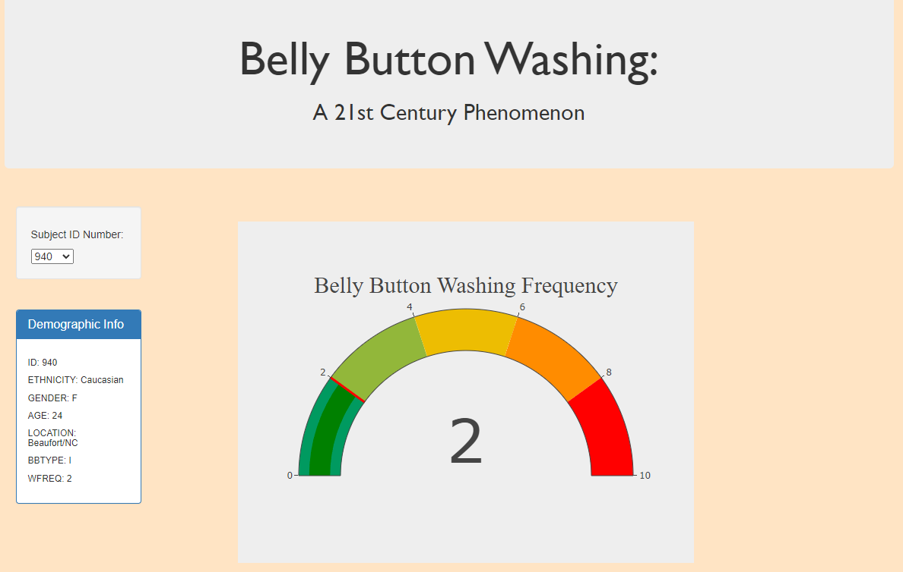
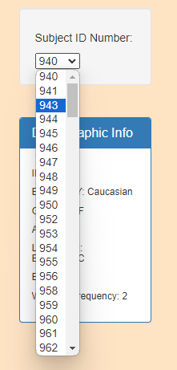
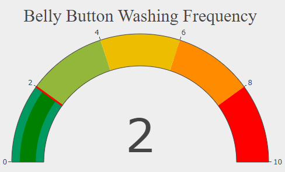
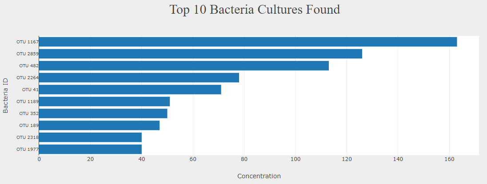
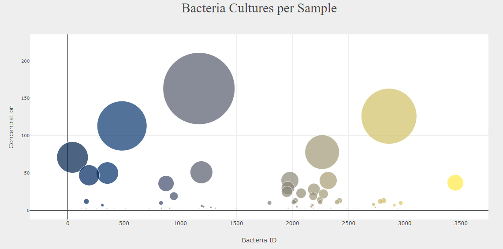

# Belly Button Dashboard
This interactive dashboard was part a mock microbiology study in which test subjects were swabbed and analyzed for the biodiversity of bacteria present on their belly buttons. 

Using the Plotly JavaScript library, this dashboard displays microbial composition of test subjects. 

## How to Use
To run this application locally:

- Clone the git repository:  
- Navigate to gut-microbiome/ in your terminal of choice
- Depending on your version of Python installed, run the following:
    Python 2.x: python -m SimpleHTTPServer
    Python 3.x: python -m http.server
- Open a browser and navigate to http://localhost:8000 (or whatever port your terminal specifies)

## Navigating the site
The website loads with data from test subject 940:

The user may change the Subject ID Number with the drop-down box to populate new data and visualizations:

Additional about each subject is also populated:
- Ethnicity
- Gender
- Age
- Location
- Belly Button type
- Washing Frequency

Three charts can be found:
### Gauge Chart: 

This indicates how frequently the subject washes their belly button

### Bar Chart

This shows the top 10 bacterial cultures found in each test subject (in operational taxa units)

### Bubble Chart

This depicts all bacterial communities found on the test subject and their concentration

